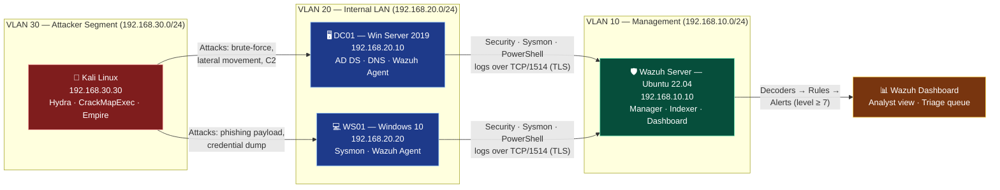
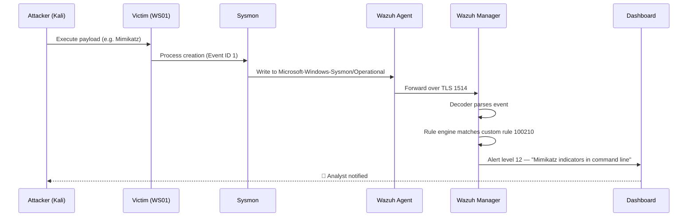

# SOC Home Lab — Wazuh SIEM with Active Directory

> A fully functional Security Operations Center home laboratory built to demonstrate practical detection engineering, incident response, and threat hunting skills for a junior SOC Analyst role.

[](https://wazuh.com/)
[](https://attack.mitre.org/)
[](#)
[](#)

---

## Project Purpose

This repository documents an end-to-end SOC home lab that I built to learn and demonstrate the day-to-day work of a Tier 1 / Tier 2 SOC Analyst. The goal was not to simply install a SIEM — it was to **build the full detection lifecycle**:

1. Deploy a realistic enterprise-like environment (domain controller, workstation, attacker host).
2. Onboard endpoints into a centralized log pipeline (Wazuh + Sysmon).
3. Execute representative adversary techniques mapped to **MITRE ATT&CK**.
4. Write and tune **custom detection rules** (Wazuh XML + Sigma).
5. Triage the generated alerts and produce an **incident report** as a real analyst would.

The lab runs entirely on a single workstation (16 GB RAM is enough) using VirtualBox or VMware Workstation, orchestrated with Vagrant and Ansible. Everything in this repository is reproducible — clone, `vagrant up`, run the attack scripts, and watch the alerts fire.

---

## Technology Stack

| Layer | Component | Version | Role |
|---|---|---|---|
| Hypervisor | VirtualBox / VMware Workstation | 7.0+ / 17+ | Runs all VMs locally |
| Provisioning | Vagrant + Ansible | 2.4 / 2.15 | Reproducible builds |
| SIEM | Wazuh Manager + Indexer + Dashboard | 4.7.x | Central log analysis |
| Server OS | Ubuntu Server | 22.04 LTS | Wazuh host |
| Domain | Windows Server | 2019 | Active Directory DC |
| Endpoint | Windows 10 Pro | 22H2 | Victim workstation |
| Telemetry | Sysmon + SwiftOnSecurity config | 15.x | Deep Windows event logging |
| Attacker | Kali Linux | 2024.x | Offensive tooling |
| Detection | Sigma | latest | Vendor-neutral rules |

---

## Architecture & Log Flow



### How a log becomes an alert



---

## Repository Layout

```
soc-home-lab/
├── README.md                            ← you are here
├── docs/
│   ├── 01-architecture.md               topology, IP plan, VLAN design
│   ├── 02-installation.md               Wazuh manager + agent install guide (PL)
│   ├── 03-attack-scenarios.md           5 scenarios × MITRE ATT&CK
│   └── 04-detection-results.md          alert walkthrough with screenshots
├── infrastructure/
│   ├── vagrant/Vagrantfile              3 VMs orchestrated as code
│   └── ansible/                         playbooks for agent rollout
├── attacks/
│   ├── 01-brute-force-ssh.sh            T1110.001 — password guessing
│   ├── 02-mimikatz-simulation.ps1       T1003.001 — LSASS memory
│   ├── 03-powershell-empire.md          T1059.001 — PowerShell C2
│   ├── 04-suspicious-process.ps1        T1218 — signed binary proxy exec
│   └── 05-data-exfiltration.py          T1041 — exfil over C2
├── detection-rules/
│   ├── custom-wazuh-rules.xml           12 custom rules with comments
│   └── sigma-rules/                     4 portable Sigma rules
└── reports/
    └── incident-report-template.md      IR write-up template
```

---

## Quick Start

```bash
# 1. Bring the lab up (≈25 min the first time)
cd infrastructure/vagrant
vagrant up

# 2. Provision Wazuh agents on the Windows hosts
cd ../ansible
ansible-playbook -i inventory.yml site.yml

# 3. Log in to the Wazuh dashboard
#    https://192.168.10.10
#    user: admin   password: SecretPassword (changed during install)

# 4. Fire an attack from Kali (host: vagrant ssh kali)
bash /vagrant/attacks/01-brute-force-ssh.sh

# 5. Watch the alerts appear in the dashboard
```

---

## What This Lab Demonstrates

- **Detection Engineering** — writing decoders and rules from raw log samples, not just enabling vendor content.
- **MITRE ATT&CK literacy** — every scenario is mapped to a specific technique ID with kill-chain context.
- **Triage & IR fundamentals** — a structured incident report template aligned with NIST SP 800-61.
- **Infrastructure as Code** — the entire lab is reproducible from a fresh machine in under 30 minutes.
- **Tool fluency** — Wazuh, Sigma, Sysmon, Hydra, Ansible, PowerShell, Linux, Active Directory.

---

## Lessons Learned (what I'd change in production)

These are the gaps between a home lab and a real production SOC — items I would treat as P1 follow-ups on day one of a real job:

1. **Log retention is fake here.** The lab keeps everything on one indexer node. In production I'd front Wazuh's indexer with hot/warm/cold ILM in OpenSearch and ship to immutable cold storage (e.g. S3 with object lock) for the regulator-mandated retention period (12–24 months depending on jurisdiction).
2. **No high availability.** A single Wazuh manager is a single point of failure. Production deployment requires a cluster (master + 2 workers minimum) behind a load balancer, and a multi-node indexer cluster with a quorum.
3. **Detection coverage is shallow.** 12 rules is a portfolio piece, not a baseline. The next step is mapping coverage against MITRE ATT&CK using DeTT&CT and tracking which sub-techniques have zero detections.
4. **No tuning loop.** In production I'd track every alert by analyst disposition (TP / FP / B-TP) in a ticketing system and feed FP rates back into rule tuning weekly. Rules without an owner get deprecated.
5. **No SOAR / playbooks.** Manual triage scales to ~50 alerts/day per analyst. Anything above that requires automated enrichment (AbuseIPDB, VT, internal CMDB) and one-click containment — I'd integrate Shuffle or TheHive + Cortex.
6. **Threat intelligence is missing.** No MISP feed, no automated IoC matching, no STIX/TAXII ingestion. The CDB lists in Wazuh are an okay starting point but they don't replace a real TIP.
7. **The "attacker" runs from inside the perimeter.** Real adversaries come through email, exposed RDP, supply chain. The lab would benefit from a simulated email gateway (e.g. an attacker mailbox + GoPhish) to test the full intrusion chain.
8. **No DFIR-ready endpoint.** Wazuh File Integrity Monitoring is useful but I'd add Velociraptor for hunt-time forensic collection, and EDR (Defender for Endpoint or CrowdStrike) for kernel-level visibility that Sysmon cannot give.
9. **AD is a single forest with default GPOs.** Production AD needs a tiering model (Tier 0/1/2), LAPS, gMSA for service accounts, and at minimum a hardened baseline (CIS L1).
10. **No purple team cadence.** Detections drift. I'd run quarterly purple-team exercises using Atomic Red Team / Caldera and measure mean-time-to-detect (MTTD) per technique.

---

## Author

Built as a portfolio project for a junior SOC Analyst role. Feedback and PRs are welcome.

**Licence:** MIT — feel free to fork, adapt, and use any part of this for your own learning.
